## Сравнение CoT и Self Consistency на BLOOM 175B
Датасет:   GSM8K  
Все эксперименты проведены на маленьком сабсете тестовой выборки (16), т.к вычислительных ресурсов недостаточно :(

# Эксперимент 1. Greedy CoT 
## Greedy decoding.  
Проверим, как на метрики влияет количество примеров Q+A в prompt.  
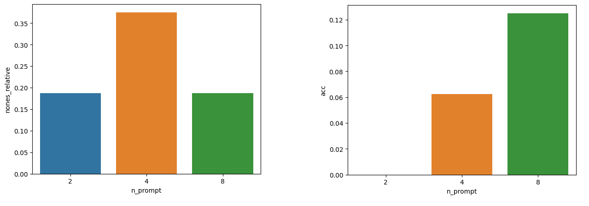</img>  
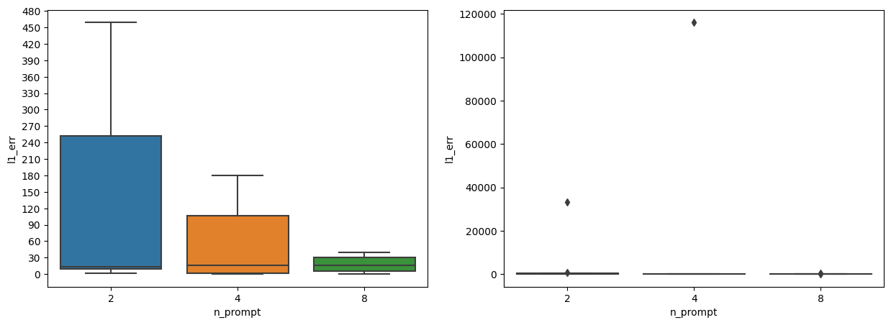</img>  
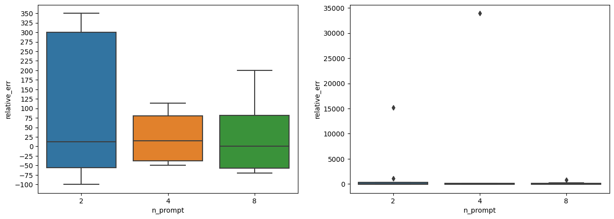</img>  
К сожалению, наша тестовая выборка мала, поэтому делать выводы можно лишь осторожно.  
Мы видим, что с ростом количества примеров растет точность, снижаются абсолютные и относительные ошибки.  
В около 20 процентов случаев в output нет финального ответа. Чаще всего это происходит из-за того, что модели не хватает токенов, чтобы дойти до ответа (В наших экспериментах есть предел на количество новых токенов - 200)

# Эксперимент 2. Self Consistency

На момент экспериментов BLOOM 175B упала (апд. так и не смог получить от нее ответ), поэтому их пришлось проводить на BLOOM 7B.  
Возьмем 8 промптов и сравним greedy и self consistency.
  
## Greedy  
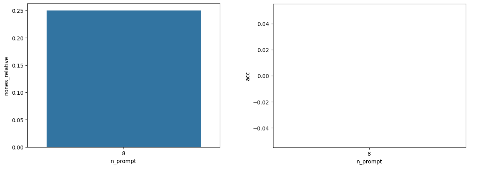</img>  
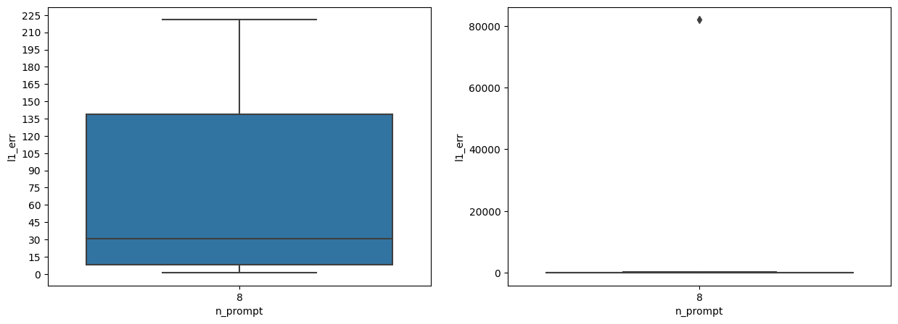</img>  
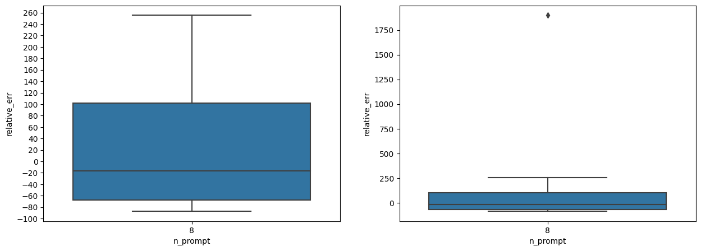</img>  

7B greedy с 8 примерами по абсолютной ошибке примерна равна 175B greedy и 4 примерами, но точность нулевая.

## Self consistency. Выбираем самый частый элемент, даже если это None.  
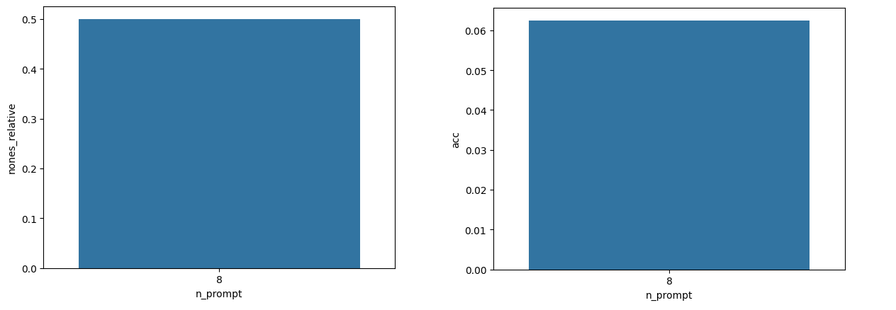</img>  
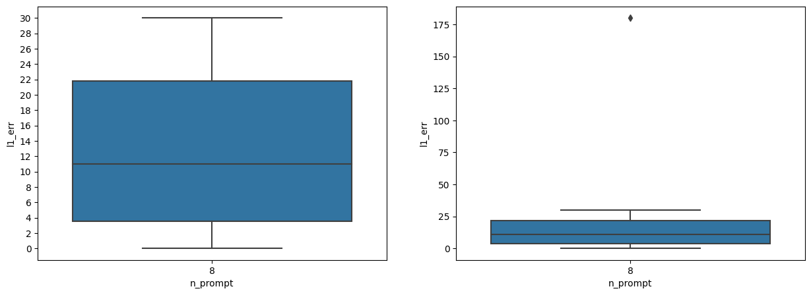</img>  
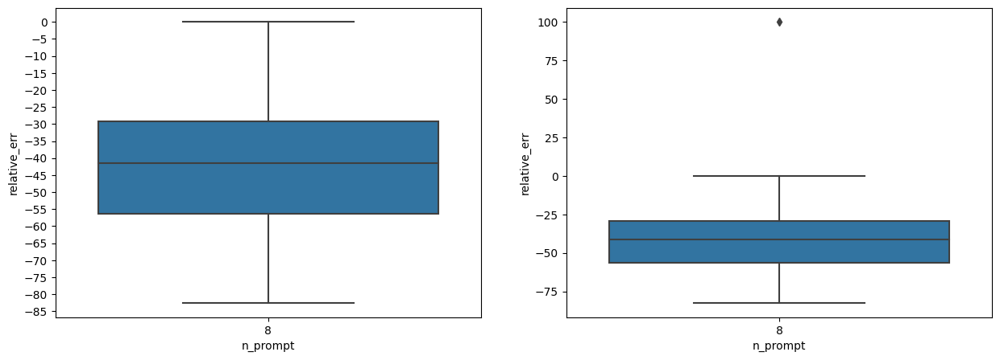</img>  
Можно наблюдать очень большое количество None. Точность повысилась, но статистика по ошибкам скошена (None не учитываеся в l1 err, rel err)
  
## Self consistency. Убираем None и выбираем самый частый элемент.

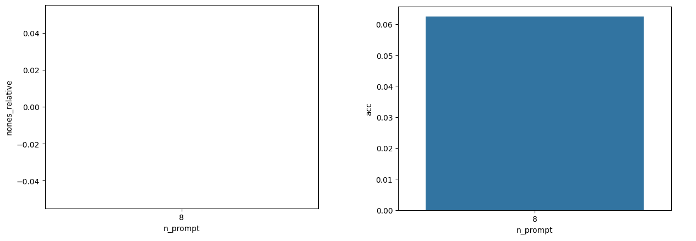</img>  
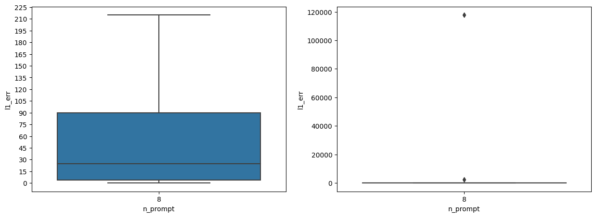</img>  
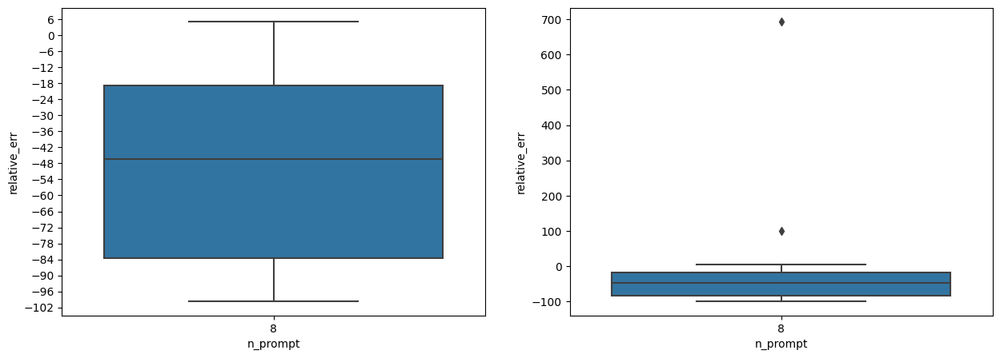</img>  

Можно сделать вывод о том, что Self-consistency положительно влияет на точность и снижает ошибки. Также у нас появляется выбор, что делать с None значениями, в greedy выбора нет.  

## Self consistency. Пробуем не совсем рандомные промпты.  
Я заметил, что если в промпте не было примеров операций с многоразрядными числами, то модель не может их адекватно использовать, например, на вопрос, где ответ в сотнях тысяч, модель дает ответы в тысячах, десятках тысяч.  
Я попробовал составить промпты так, чтобы они были наиболее разнообразные - чтобы были разные длины цепочек мыслей и разные разрядности ответов. Идея хорошая, но на 7B метрики упали :(
Графики нет смысла вставлять, но они есть в ноутбуке.
